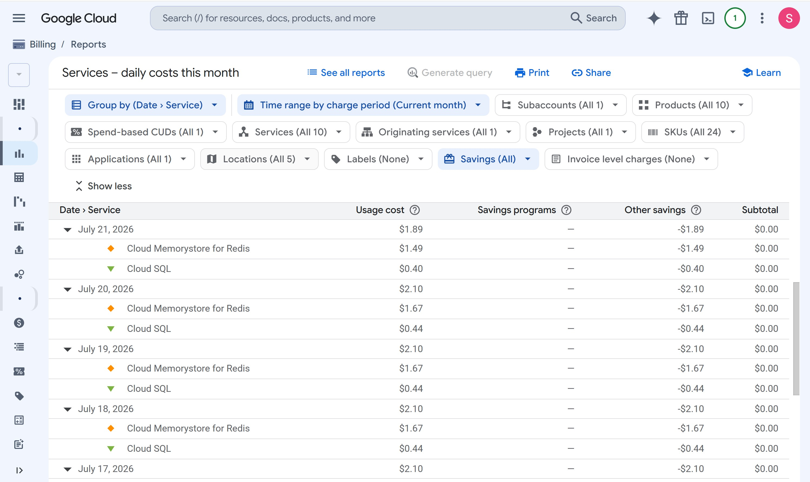

# Architecture Evolution: Delta Analysis (Initial Spec vs. MVP Reality)

This document serves as a Delta Analysis contrasting the initial Agentic CRM product requirements document (PRD) with the current minimum viable product (MVP) architecture, which has maintained physical infrastructure costs to a sub-$60/month hybrid-cloud run-rate (currently shielded by GCP free trial credits) while preserving the logical boundaries required for future enterprise scaling.

---

## 1. Core Infrastructure Topology (The Pivot to Hybrid-Local)

The most significant shift in the project occurred in the physical deployment topology, transitioning from a fully managed Cloud-Native architecture to a Hybrid-Local Docker environment.

### Initial Specification
*   **Design:** 100% Google Cloud Native serverless execution.
*   **CRM Host:** Vanilla TwentyCRM Docker images running on stateless Google Cloud Run.
*   **AI Orchestrator:** Independent Node.js/TypeScript application deployed on Google Cloud Run (`min_instances=1`).
*   **Databases:** Fully managed Google Cloud SQL (PostgreSQL) for relational data and Google Cloud Memorystore (Redis Standard Tier) for distributed caching.

### MVP Reality
*   **Execution:** A Hybrid-Cloud split to protect the startup runway while maintaining production-readiness.
*   **CRM Host:** The heavy TwentyCRM monolith runs locally via `docker-compose` to eliminate large compute overhead.
*   **AI Orchestrator:** Runs as a local Node.js process alongside the CRM.
*   **Databases:** Live Google Cloud Memorystore (Redis) for distributed caching and live Google Cloud SQL (PostgreSQL) for proprietary AI metadata storage.

### 💡 Product Management Impact
While the *physical* deployment changed, the *logical boundaries* (containerization and API decoupling) were preserved. The AI Orchestrator and the CRM remain completely separate decoupled services. By splitting the monolith—running the heavy CRM compute locally while utilizing managed live GCP resources for the critical AI databases—moving the rest of the stack to Cloud Run later is a "lift-and-shift" operation rather than a painful code refactor.

---

## 2. Event Ingestion & Webhook Routing

The system relies heavily on asynchronous event-driven triggers. Handling inbound webhooks securely without incurring massive load-balancer costs required a strategic pivot.

### Initial Specification 
*   **Design:** Direct public ingress to a Cloud Run middleware service.
*   **Security:** Cryptographic authentication via HMAC-SHA256 signature verification and 5-minute timestamp drift checks.
*   **Queueing:** Payloads published directly to Google Cloud Pub/Sub (`crm-events-ingress`), with delayed processing via Google Cloud Tasks.

### MVP Reality 
*   **Execution:** Webhooks leverage a **Dual-Active State**. Google Workspace push notifications hit Cloudflare Zero Trust, which routes to the local AI Orchestrator during the day, and fails over to Google Cloud Run overnight as a webhook catcher. Internal CRM webhooks are tunneled to the local machine using **Smee.io**.
*   **Queueing:** Google Cloud Pub/Sub is live for asynchronous decoupling, but the downstream Cloud Functions for processing Dead-Letter Queues (DLQ) are explicitly marked as "Deferred / Simulated."
*   **Ingress:** The Cloud Run middleware acts as an overnight ingress catcher, while the local Express route acts as the primary daytime ingress.

### 💡 Product Management Impact
Swapping a premium GCP Load Balancer/API Gateway for Cloudflare Zero Trust and Smee.io saved massive bandwidth costs and eliminated the need to purchase public TLS certificates during development. It enabled rapid local debugging of the webhook lifecycle while providing enterprise-grade overnight failover routing.

---

## 3. Data Storage & Intellectual Property Sovereignty

A core mandate of Agentic CRM was protecting proprietary AI logic (Intent Scoring, Action Logs) from bleeding into the AGPL-3.0 copyleft license of the open-source TwentyCRM database.

### Initial Specification 
*   **Design:** Total physical isolation.
*   **Storage:** A dedicated, private Cloud SQL instance owned *exclusively* by the AI Orchestrator for all AI-generated derivative data. TwentyCRM would only store an opaque UUID.

### MVP Reality 
*   **Execution:** Physical isolation was perfectly maintained.
*   **Storage:** The system provisions a dedicated, private Google Cloud SQL database instance alongside a dedicated Google Memorystore (Redis) instance on GCP, ensuring strict, enterprise-grade data isolation from the local TwentyCRM open-source database.

### 💡 Product Management Impact
The legal IP firewall is proven, and the $60/month run-rate is offset by the $425 CAD GCP free trial credits, ensuring the IP is protected without burning actual capital for now.

---

## 4. Security & Compliance (Deferred Enterprise Features)

### Initial Specification 
*   **Design:** Hard enterprise compliance baselines.
*   **Integration:** Native integration with Google Cloud Security Command Center (SCC) for vulnerability scanning, and the Google Cloud DLP API for active PII (Personally Identifiable Information) sanitization.

### MVP Reality 
*   **Execution:** SCC and Cloud DLP are explicitly categorized as "Deferred / Ready for Connection."
*   **Sanitization:** PII masking is currently handled via lightweight local Regex patterns.

### 💡 The Product Management Impact
Enterprise security tools like SCC and DLP APIs carry heavy premium costs. These have been deferred to the V2 sprint backlog, in the hopes to develop the MVP sooner while keeping the hybrid run-rate below $60/month. The architectural integration points remain documented and ready for when the additional funding arrives.

### 🧾 Proof of Unit Economics (GCP Billing Dashboard)
The following is a screenshot from the active Google Cloud Billing dashboard, verifying the sub-$60/month Hybrid-Cloud footprint.

As demonstrated, the heavy monolithic compute costs are successfully bypassed via the local `docker-compose` environment, while the live managed instances for Google Cloud SQL and Google Cloud Memorystore log an active usage cost of ~$2.00 CAD per day. This infrastructure burn is currently shielded by the free trial credits, resulting in a net-zero impact to the startup's cash runway for the time being.

---

## 5. Unplanned Enterprise Upgrades (The Proactive Moat)

The most critical evolution in the Agentic CRM was the introduction of enterprise-grade reliability features that were *never planned in the original spec*, but were proactively integrated to harden the MVP.

### Initial Specification 
*   **Design:** Standard API routing and error handling.
*   **LLM Routing:** Hardcoded direct API calls to Google Gemini.
*   **Security:** Standard HTTPS polling without strict tunnel isolation.

### MVP Reality 
*   **Execution:** Proactive integration of fault-tolerance and Zero Trust perimeters.
*   **Cloudflare AI Gateway & Degraded Modes:** Cloudflare AI Gateway provides ~50ms exact-match edge caching. The (Node.js) AI Orchestrator is hard-coded to intercept Gateway 500-errors and manually fallback to the direct Vertex AI SDK, ensuring enterprise-grade LLM uptime.
*   **Circuit Breakers:** Implemented an Opossum circuit breaker in the web server to prevent cascading LLM latency timeouts from overflowing the Node.js event loop.
*   **Idempotency Locks:** Implemented a strict 10-minute Redis `SET...NX` idempotency lock to mathematically shield the architecture against duplicate webhook firing and runaway AI token burns.
*   **Zero Trust Tunnels:** Adopted Cloudflare Zero Trust and Server-Sent Events (SSE) to stream data unidirectionally to the frontend, eliminating exposed public ports.

### 💡 The Product Management Impact
While infrastructure costs were slashed on idle compute resources, those savings were immediately re-invested into network reliability and security. Recognizing the volatility of LLM API endpoints during the build phase and proactively implementing circuit breakers and edge failovers allowed us to adapt the architecture to real-world engineering constraints, rather than blindly following an initial specification document.

---

## Conclusion

The initial specifications provided the **North Star architecture** while the MVP reality provides the **financial pragmatism**. The result is a functional, event-driven agentic platform that runs on a sub-$60/month hybrid-cloud architecture today, poised to scale to a fully managed enterprise cloud tomorrow.
